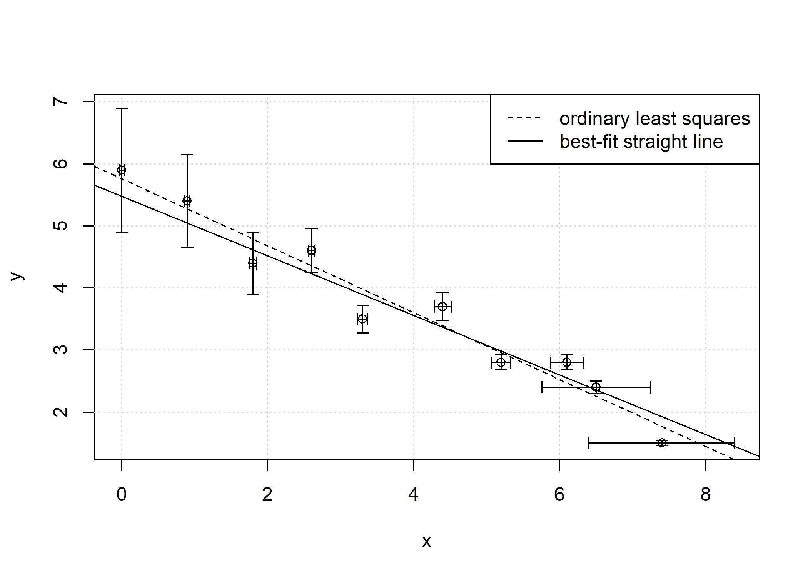

<!-- README.md is generated from README.Rmd. Please edit that file -->

# R package bfsl: Best-fit Straight Line

<!-- badges: start -->

[](https://github.com/pasturm/bfsl/actions)
[](https://codecov.io/gh/pasturm/bfsl)
[](https://cran.r-project.org/package=bfsl)
[](https://cran.r-project.org/package=bfsl)
[](https://cran.r-project.org/package=bfsl)
[](https://www.repostatus.org/#active)
<!-- badges: end -->

### How to fit a straight line through a set of points with errors in both coordinates?

The solution for the best-fit straight line to independent points with
normally distributed errors in both *x* and *y* is known from York
([1966](#york66), [1968](#york68), [2004](#york04)). It provides
unbiased estimates of the intercept, slope and standard errors of the
best-fit straight line, even when the *x* and *y* errors are correlated.

Surprisingly, as Wehr and Saleska ([2017](#wehr17)) point out, York’s
solution has escaped the attention of many scientists that are writing
on straight-line fitting with errors in both *x* and *y* (also known as
Model II regressions, errors-in-variables models or measurement error
models).

Other commonly used least-squares estimation methods, such as ordinary
least-squares regression, orthogonal distance regression (also called
major axis regression), geometric mean regression (also called reduced
major axis or standardised major axis regression) or Deming regression
are all special cases of York’s solution and only valid under particular
measurement conditions.

The bfsl package implements York’s general solution and provides the
best-fit straight line of bivariate data with errors in both
coordinates.

## Example

``` r
library(bfsl)
fit = bfsl(pearson_york_data)
plot(fit)
ols = bfsl(pearson_york_data, sd_x = 0, sd_y = 1)
abline(coef = ols$coef[,1], lty = 2)
legend("topright", c("ordinary least squares", "best-fit straight line"), lty = c(2,1))
```



``` r
bfsl(pearson_york_data)
#> Best-fit straight line
#> 
#>            Estimate  Std. Error
#> Intercept   5.47991   0.29497  
#> Slope      -0.48053   0.05799  
#> 
#> Goodness of fit:
#> 1.483
```

## Installation

Install bfsl from CRAN with:

``` r
install.packages("bfsl")
```

Install the development version from GitHub with:

``` r
if (!require("remotes")) { install.packages("remotes") }
remotes::install_github("pasturm/bfsl")
```

See the [NEWS file](https://github.com/pasturm/bfsl/blob/master/NEWS.md)
for latest release notes.

## References

<a name="york66"></a>York, D. (1966). Least-squares fitting of a
straight line. *Canadian Journal of Physics*, 44(5), 1079–1086,
<https://doi.org/10.1139/p66-090>

<a name="york68"></a>York, D. (1968). Least squares fitting of a
straight line with correlated errors. *Earth and Planetary Science
Letters*, 5, 320–324, <https://doi.org/10.1016/S0012-821X(68)80059-7>

<a name="york04"></a>York D. et al. (2004). Unified equations for the
slope, intercept, and standard errors of the best straight line,
*American Journal of Physics*, 72, 367-375,
<https://doi.org/10.1119/1.1632486>

<a name="wehr17"></a>Wehr, R. and Saleska, S. R. (2017). The long-solved
problem of the best-fit straight line: application to isotopic mixing
lines, *Biogeosciences*, 14, 17-29,
<https://doi.org/10.5194/bg-14-17-2017>
